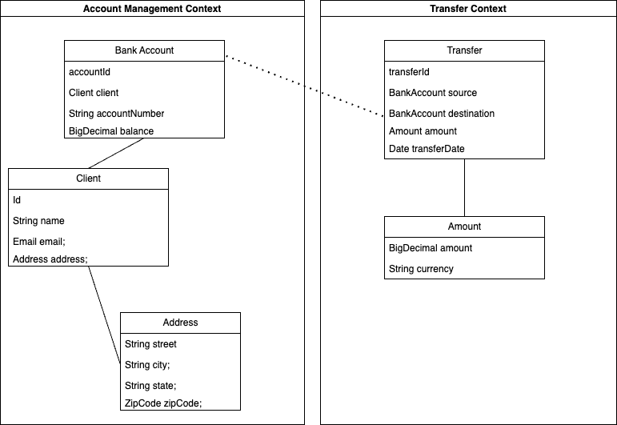

# DDD - zadanie zamodelowania fragmentu systemu bankowego

Zadanie ma na celu zamodelowanie fragmentu bezpiecznej aplikacji bankowej wykorzystując zasady metodyki `Domain Driven Design`.

Poniżej znajduje się diagram modelu:

## 1. Bounded Context

Zdefiniowane zostały w aplikacji dwa konteksty :

- Account Management Context - zawiera wszelkie operacje powiązane z zarządzaniem kontami
- Transfer Context - zawiera wszelkie operacje powiązane z przelewami

## 2. Modelowanie agregatów, encji i obiektów wartości

### Agregaty

1. BankAccount - obsługuje operacje związane z rachunkami, takie jak otwieranie, zamykanie i modyfikowanie rachunków.
2. Transfer - reprezentuje transakcje (przelew)

### Encje

1. BankAccount
2. Transfer
3. Client

### Value Objects

1. Address
2. Amount
3. ZipCode
4. Email

## Przyjęte założenia

| Encja/Obiekt wartości | Atrybuty                                              | Opis                                                                                                                                                                                 |
| --------------------- | ----------------------------------------------------- | ------------------------------------------------------------------------------------------------------------------------------------------------------------------------------------ |
| BankAccount           | accountId, accountNumber, balance, client             | Encja obsługuje operacje związane z kontem klienta, zawiera numer konta, referencje do klienta (Client), wartość konta                                                               |
| Client                | Id, name, email, address                              | Encja mająca unikalne id, Imię i nazwisko, Email jako obiekt wartości, który odpoiwada za walidację podczas kreacji (format / długość), Adres jako obiekt wartości                   |
| Address               | street, city, state, zipCode                          | Obiekt wartości reprezentujacy adres, ulica, miasto, województwo / stan, kod pocztowy - odpowiednia weryfikacja każdego pola                                                         |
| Transfer              | transferId, source, destination, amount, transferDate | Encja reprezentowana przez unikalne id, zawiera wartość przelewu (Amount), datę oraz ma relację z encją `BankAccount` - zródło oraz destynacja przelewu                              |
| Amount                | currency, amount                                      | Obiekt wartości reprezentujący kwotę przelewu, jego wielkość oraz wlutę , odpowiada za walidację czy kwota jest w dobrej walucie i jest w odpwiednim przedziale wartości np (0, MAX) |
| ZipCode               | zipCode                                               | Obiekt wartości reprezentujący kod pocztowy, pozwala na weryfikację formatu (\d{2}-\d{3})                                                                                            |
| Email                 | email                                                 | Obiekt wartości reprezentujący adres email, pozwala na weryfikację formatu (\*.@orange.com)                                                                                          |
